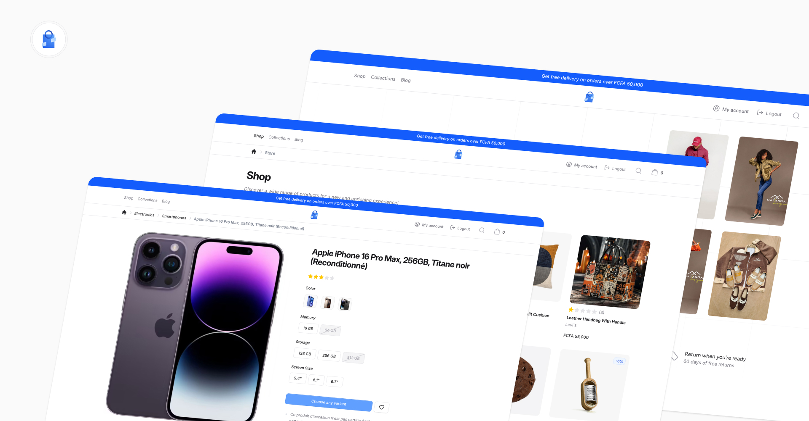

<p align="center">
    <a href="https://demo.laravelshopper.dev" title="Shopper demo store">
        
    </a>
</p>

# Shopper Demo store

A full-featured demo e-commerce app built with [Shopper](https://laravelshopper.dev). It covers a realistic storefront with product catalog, multi-step checkout, customer accounts, a blog, and a complete admin panel, so you can see how Shopper handles real-world use cases.

## Getting started

Clone and install:

```sh
git clone https://github.com/shopperlabs/demo.laravelshopper.dev.git shopper-demo && cd shopper-demo
composer install
npm install && npm run build
```

Set up the project:

```sh
composer setup
```

Then access the storefront at the URL provided by your local server and log in to the admin panel at `/cpanel`:

- **Email:** admin@laravelshopper.dev
- **Password:** demo.Shopper@2026!

## What's in the box

### Storefront

A fully responsive storefront built with Livewire 3, Volt, Flux UI, and Tailwind CSS v4:

- **Product catalog**: browsable store with attribute filtering, search, and pagination
- **Category & collection pages**: products organized by categories and curated collections
- **Product detail**: variant selector, image gallery, pricing by currency, ratings, and related products
- **Multi-step checkout**: shipping address, delivery method, and payment selection in a guided wizard
- **Payment gateways**: Cash on delivery, Stripe, and NotchPay integrations
- **Customer accounts**: profile management, address book with default selection, and order history
- **Blog**: articles with categories, authors, featured images, and rich content
- **Multi-zone support**: country-based zones with currency-specific pricing and shipping options
- **Breadcrumb navigation**: contextual breadcrumbs across all pages

### Admin Panel

The admin panel at `/cpanel` is powered by Shopper's built-in Filament integration with custom extensions:

- **Products**: full CRUD with variants, attributes, multi-currency pricing, media uploads, and stock management
- **Categories & collections**: hierarchical categories and rule-based collections
- **Orders**: status tracking, shipping with tracking numbers, refunds, and notes
- **Customers**: account management, address records, and geolocation history
- **Discounts**: configurable discount codes with conditions and usage limits
- **Shipping & payments**: zone-based shipping options and payment method configuration
- **Blog management**: post editor with rich text, featured images, publication scheduling, and category organization
- **Settings**: general shop configuration, attributes, and brands

## Tech stack

| Layer         | Technology           |
|---------------|----------------------|
| Framework     | Laravel 12           |
| Admin panel   | Shopper + Filament 4 |
| Reactivity    | Livewire 3 + Volt    |
| UI components | Flux UI              |
| Styling       | Tailwind CSS 4       |
| Cart          | Darryldecode Cart    |

## Patterns worth looking at

| Pattern                           | Where to find it                                   |
|-----------------------------------|----------------------------------------------------|
| Multi-step checkout wizard        | Place an order from the cart                       |
| Variant selector with stock check | Pick a size or color on a product page             |
| Zone-based currency switching     | Change your delivery zone from the header          |
| Payment gateway integration       | Choose Stripe or NotchPay at checkout              |
| Attribute filtering               | Filter products by color or size on the store page |
| Extending Shopper sidebar         | Check the Blog section in the admin sidebar        |
| Custom Shopper admin pages        | Create or edit a blog post in the admin panel      |
| Address management                | Set a default shipping address in your account     |
| Product reviews                   | Leave a review on any product page                 |
